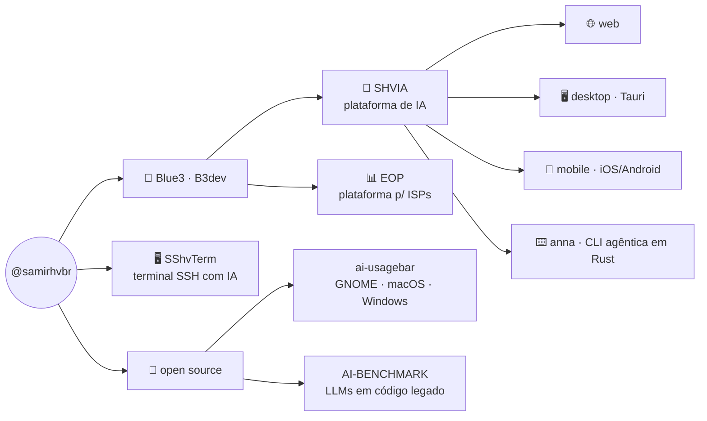

# `samir@github:~$`

<div align="center">

[](https://samirhv.com.br)
[](https://area81.com.br)
[](mailto:samirhv@proton.me)

</div>

```text
$ fastfetch --profile samir

samir@github
──────────────────────────────────────────────────────
Nome         Samir Hanna Verza
Host         Brasil
Empresas     Blue3 · B3dev
Função       builder full-stack · engenharia de IA/LLM
Kernel       Rust · PHP · Java · TypeScript · Python
Shell        bash · anna (CLI agêntica que eu construí)
DE           GNOME (com extensões próprias)
Superfícies  web · desktop · mobile · terminal
Uptime       sempre buildando
```

## `$ cat ~/ecossistema.mmd`



## `$ ls ~/produtos/`

| projeto | o que é |
|---|---|
| **[SHVIA](https://ia.blue3.com.br)** | Plataforma de IA multi-superfície — web, desktop (Tauri), [mobile iOS/Android](https://github.com/samirhvbr/SHVIA-MOBILE) e CLI. Gateway BYOK multi-provedor, voz (STT/TTS) e modo código. Nascida na [Blue3](https://blue3.com.br) / [B3dev](https://b3dev.com.br). |
| **anna** | CLI agêntica em Rust — loop de ferramentas com gates de segurança, embutível em outros apps. É o motor de código do SHVIA. |
| **SShvTerm** | Terminal SSH (desktop Tauri 2 + mobile) com agente de IA embarcado — o terminal que conversa. |
| **EOP** | Enterprise Operating Platform — gestão ledger-first para provedores de internet, na Blue3. |

## `$ ls ~/open-source/`

- **[AI-BENCHMARK](https://github.com/samirhvbr/AI-BENCHMARK)** — RFC + harness do *LLM Engineering Benchmark*: mede LLMs consertando **código legado sem quebrar compat** — o oposto do greenfield
- **[ai-usagebar](https://github.com/akitaonrails/ai-usagebar)** — integrações desktop (GNOME · macOS · Windows) contribuídas pro upstream
- **[GITHUB-DESKTOP](https://github.com/samirhvbr/GITHUB-DESKTOP)** — fork do GitHub Desktop com dashboard multi-repo
- **[hermes-agent](https://github.com/samirhvbr/hermes-agent)** — fork do agente open da Nous Research
- **[Vitals](https://github.com/samirhvbr/Vitals)** · **[claude-desktop-debian](https://github.com/samirhvbr/claude-desktop-debian)** · Matomo · CSL-Redes — forks e contribuições do dia a dia

## `$ cat ~/.config/stack.toml`

```toml
[linguagens]
diarias     = ["Rust", "PHP", "TypeScript", "Java", "Python", "Swift"]

[frameworks]
apps        = ["Tauri 2", "Laravel", "Spring Boot", "React + Vite"]

[dados]
bancos      = ["PostgreSQL", "PostGIS", "pgvector", "MariaDB"]

[ia]
frentes     = ["gateways de inferência", "agentes", "RAG", "STT/TTS", "benchmark de LLM"]

[superficies]
alvo        = ["web", "desktop Linux/macOS/Windows", "mobile iOS/Android", "CLI", "GNOME Shell"]
```

## `$ history | tail -3`

```text
 998  publicar o cliente mobile do SHVIA nas lojas
 999  contribuir as integrações desktop do ai-usagebar pro upstream
1000  especificar o LLM Engineering Benchmark — IA em código legado
```

## `$ gh stats --user samirhvbr`

<div align="center">
  
  
</div>

## `$ ping samir`

- 🌐 **[samirhv.com.br](https://samirhv.com.br)** — página pessoal & central de downloads
- ✍️ **[AREA81](https://area81.com.br)** — o blog
- 🏢 **[blue3.com.br](https://blue3.com.br)** · **[b3dev.com.br](https://b3dev.com.br)**
- ✉️ **samirhv@proton.me**

<div align="center"><sub><code>$ exit</code> — o prompt fica aberto · <b>do backend ao binário</b> 🇧🇷</sub></div>
