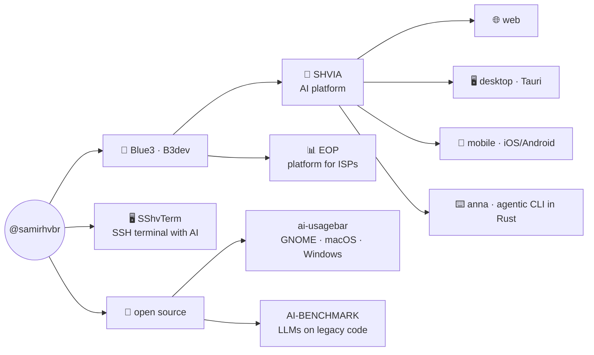

# `samir@github:~$`

<div align="center">

[](https://samirhv.com.br)
[](https://area81.com.br)
[](mailto:samirhv@proton.me)

</div>

```text
$ fastfetch --profile samir

samir@github
──────────────────────────────────────────────────────
Name         Samir Hanna Verza
Host         Brazil
Companies    Blue3 · B3dev
Role         full-stack builder · AI/LLM engineering
Kernel       Rust · Ruby · PHP · Java · TypeScript · Python
Shell        bash · anna (agentic CLI I built)
DE           GNOME (with my own extensions)
Surfaces     web · desktop · mobile · terminal
Uptime       always building
```

## `$ cat ~/ecosystem.md`



## `$ ls ~/products/`

| project | what it is |
|---|---|
| **[SHVIA](https://ia.blue3.com.br)** | Multi-surface AI platform — web, desktop (Tauri), [mobile iOS/Android](https://github.com/samirhvbr/SHVIA-MOBILE) and CLI. Multi-provider BYOK gateway, voice (STT/TTS) and code mode. Born at [Blue3](https://blue3.com.br) / [B3dev](https://b3dev.com.br). |
| **anna** | Agentic CLI in Rust — tool loop with safety gates, embeddable in other apps. It is SHVIA's code engine. |
| **[SShvTerm](https://sshvterm.com)** | SSH terminal (Tauri 2 desktop + mobile) with an embedded AI agent — the terminal that talks back. · [sshvterm.com](https://sshvterm.com) |
| **EOP** | Enterprise Operating Platform — ledger-first management for internet service providers, at Blue3. |

## `$ ls ~/open-source/`

- **[AI-BENCHMARK](https://github.com/samirhvbr/AI-BENCHMARK)** — RFC + harness for the *LLM Engineering Benchmark*: measures LLMs fixing **legacy code without breaking compatibility** — the opposite of greenfield
- **[ai-usagebar](https://github.com/akitaonrails/ai-usagebar)** — desktop integrations (GNOME · macOS · Windows) contributed upstream
- **[GITHUB-DESKTOP](https://github.com/samirhvbr/GITHUB-DESKTOP)** — GitHub Desktop fork with a multi-repo dashboard
- **[hermes-agent](https://github.com/samirhvbr/hermes-agent)** — fork of Nous Research's open agent
- **[Vitals](https://github.com/samirhvbr/Vitals)** · **[claude-desktop-debian](https://github.com/samirhvbr/claude-desktop-debian)** · Matomo · CSL-Redes — day-to-day forks and contributions

## `$ cat ~/.config/stack.toml`

```toml
[languages]
daily       = ["Rust", "Ruby", "PHP", "TypeScript", "Java", "Python", "Swift"]

[frameworks]
apps        = ["Tauri 2", "Rails", "Laravel", "Spring Boot", "React + Vite"]

[data]
databases   = ["PostgreSQL", "PostGIS", "pgvector", "MariaDB"]

[ai]
tracks      = ["inference gateways", "agents", "RAG", "STT/TTS", "LLM benchmarking"]

[surfaces]
targets     = ["web", "desktop Linux/macOS/Windows", "mobile iOS/Android", "CLI", "GNOME Shell"]
```

## `$ history | tail -3`

```text
 998  ship the SHVIA mobile client to the app stores
 999  contribute the ai-usagebar desktop integrations upstream
1000  spec out the LLM Engineering Benchmark — AI on legacy code
```

## `$ gh stats --user samirhvbr`

<div align="center">

[](https://github.com/samirhvbr?tab=followers)


</div>

## `$ ping samir`

- 🌐 **[samirhv.com.br](https://samirhv.com.br)** — personal page & download hub
- ✍️ **[AREA81](https://area81.com.br)** — the blog
- 🖥️ **[sshvterm.com](https://sshvterm.com)** — SShvTerm
- 🏢 **[blue3.com.br](https://blue3.com.br)** · **[b3dev.com.br](https://b3dev.com.br)**
- ✉️ **samirhv@proton.me**

<div align="center"><sub><code>$ exit</code> — the prompt stays open · <b>from backend to binary</b> 🇧🇷</sub></div>
